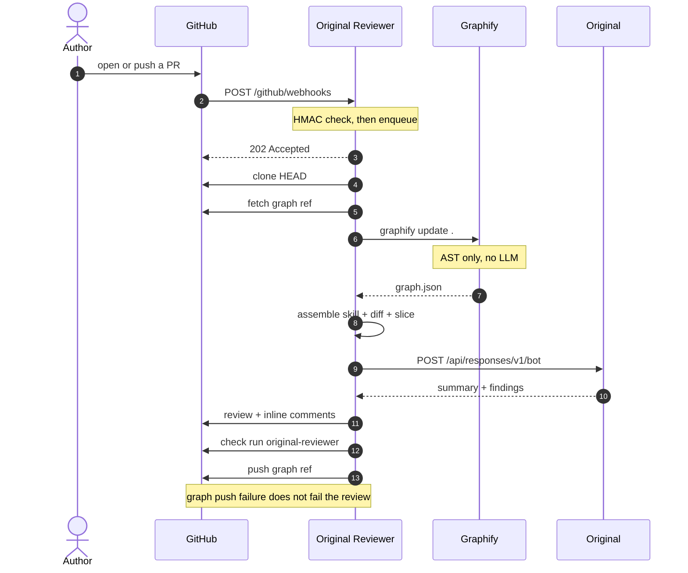
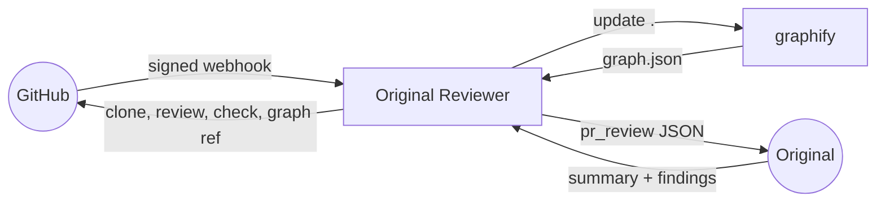

# Original Reviewer

[](https://github.com/noku-team/original-reviewer/actions/workflows/ci.yml)
[](https://bun.sh)
[](https://www.typescriptlang.org/)
[](https://eslint.org/)
[](https://vitest.dev/)

GitHub App for CodeRabbit-shaped pull request review. Inference runs on a public [Original](https://ai.original.land) agent. Context comes from a persistent graphify AST graph stored on `refs/original-reviewer/graph` — not a dump of the whole repo into the prompt.





Same binary for hosted (Original Connect) and self-host (`ORIGINAL_API_KEY`).

---

## Install

### 1. Bun 1.3+

```bash
curl -fsSL https://bun.sh/install | bash
# reopen the shell, then:
bun --version   # >= 1.3.0
```

Also needed: **Git**, and a **GitHub App**. Optional: **Redis** (hosted / multi-process), **graphify** on `PATH` (AST graph; skipped if missing).

### 2. Clone and install

```bash
git clone git@github.com:noku-team/original-reviewer.git
cd original-reviewer
bun install
```

Lockfile is `bun.lock`. Do not use npm/pnpm.

### 3. Environment

```bash
cp .env.example .env
```

Bun loads `.env` automatically. Fill the values:

| Variable | Required | Notes |
| --- | --- | --- |
| `GITHUB_APP_ID` | yes | GitHub App id |
| `GITHUB_PRIVATE_KEY` | yes | PEM for the App (newlines allowed) |
| `GITHUB_WEBHOOK_SECRET` | yes | verifies `X-Hub-Signature-256` |
| `GITHUB_APP_SLUG` | no | mention slug, default `original-reviewer` |
| `ORIGINAL_API_BASE` | yes | e.g. `https://ai-api.original.land` |
| `ORIGINAL_BOT_ID` | yes | public reviewer bot id |
| `ORIGINAL_API_KEY` | self-host | disables `/connect/*` |
| `ORIGINAL_CONNECT_AUTHORIZE_URL` | hosted | OAuth authorize |
| `ORIGINAL_CONNECT_TOKEN_URL` | hosted | OAuth token exchange |
| `ORIGINAL_CONNECT_SCOPE` | hosted | default `openid agent.chat:<bot id>` |
| `PORT` | no | default `3000` |
| `REDIS_URL` | no | queue + Connect tokens; memory (lost on restart) if unset |

Never set `GEMINI_API_KEY` or `GOOGLE_API_KEY` on the worker. Graphify must stay AST-only.

### 4. GitHub App

Create it under the org (hosted) or your user (self-host):

- Org: [github.com/organizations/noku-team/settings/apps/new](https://github.com/organizations/noku-team/settings/apps/new)
- User: [github.com/settings/apps/new](https://github.com/settings/apps/new)

The **GitHub App name** must be unique on GitHub. Prefer `Original Reviewer` so the mention handle is `@original-reviewer`. If that name is taken, use something like `Original Reviewer Noku` and set `GITHUB_APP_SLUG` to the slug in the App URL (`github.com/apps/<slug>`).

Paste this into the form:

| Field | Value |
| --- | --- |
| **GitHub App name** | `Original Reviewer` |
| **Homepage URL** | `https://github.com/noku-team/original-reviewer` |
| **Callback URL** | leave empty (this slice uses installation tokens, not user OAuth) |
| **Expire user authorization tokens** | default |
| **Request user authorization (OAuth) during installation** | **off** |
| **Setup URL** (hosted) | `https://<your-host>/connect/original` |
| **Redirect on update** | on, if you set a Setup URL |
| **Webhook** | **Active** |
| **Webhook URL** | `https://<your-host>/github/webhooks` |
| **Webhook secret** | `openssl rand -hex 32` → same value as `GITHUB_WEBHOOK_SECRET` |
| **SSL verification** | Enable |
| **Where can this GitHub App be installed?** | hosted: **Any account**. self-host/dev: **Only on this account** |

**Logo:** upload [`docs/brand/logo.png`](docs/brand/logo.png) as the App avatar (GitHub’s logo field, not the description).

**Description:** paste [docs/github-app-description.md](docs/github-app-description.md). GitHub renders it as Markdown on the public App page.

**Repository permissions**

| Permission | Access | Why |
| --- | --- | --- |
| Metadata | Read-only | Required by GitHub |
| Contents | Read and write | Clone HEAD; push `refs/original-reviewer/graph` |
| Pull requests | Read and write | Reviews and inline comments |
| Checks | Read and write | Check run `original-reviewer` |
| Issues | Read and write | Marker comment and `@original-reviewer` commands |

Leave **Account** and **Organization** permissions at No access. Do not grant Workflows, Actions, or Merge queues.

**Subscribe to events** (this list): Check run, Issue comment, Pull request, Pull request review comment, Push.

Do **not** tick **Installation target** — that fires when an account/org is renamed. `installation` and `installation_repositories` are [sent to every GitHub App by default](https://docs.github.com/webhooks/webhook-events-and-payloads#installation) and do not appear here.

Local webhook (dev): expose `http://localhost:3000` with Cloudflare Tunnel or ngrok, then put that origin in Webhook URL and Setup URL.

```bash
cloudflared tunnel --url http://localhost:3000
# Webhook URL: https://<tunnel>/github/webhooks
```

After **Create GitHub App**:

1. Copy **App ID** → `GITHUB_APP_ID`.
2. Copy the slug from the URL → `GITHUB_APP_SLUG` (default `original-reviewer`).
3. **Generate a private key**, download the `.pem`, paste the full PEM into `GITHUB_PRIVATE_KEY` (quoted, multiline is fine in `.env`).
4. Confirm the webhook secret matches `.env`.
5. **Install** the App on a test repository (Repository permissions → Install).
6. Hosted: GitHub sends you to the Setup URL with `installation_id`; or open `/connect/original?installation_id=<id>`. Self-host: set `ORIGINAL_API_KEY` and skip Connect.

### 5. Run

```bash
bun run dev
```

Listens on `PORT` (default 3000).

- Self-host: set `ORIGINAL_API_KEY`, skip Connect.
- Hosted: leave the API key empty, open `/connect/original?installation_id=<id>` after installing the App.

Health copy is at `GET /`.

### Container

Image is Bun + git + graphify. Inject the same env as `.env.example` (k8s Secret / ConfigMap). Do not bake secrets. Probe `GET /` on `PORT`. Redis is optional but required if you run more than one replica.

```bash
docker build -t original-reviewer .
docker run --rm -p 3000:3000 --env-file .env original-reviewer
```

### 6. Repo under review

Optional `.original-reviewer.yaml` at the **feature branch** root:

```yaml
language: en-US
reviews:
  request_changes_workflow: false
  auto_review:
    enabled: true
    drafts: false
  path_filters: []
  path_instructions: []
```

Missing file → those defaults. Invalid YAML → failed check, no review.

Guideline files loaded when present: `AGENTS.md`, `CLAUDE.md`, `GEMINI.md`, `.cursorrules`, `docs/reviewer/SKILL.md`.

---

## Commands

Mention the App on a PR comment (`GITHUB_APP_SLUG`, default `original-reviewer`):

| Comment | Effect |
| --- | --- |
| `@original-reviewer review` | enqueue a review |
| `@original-reviewer full review` | full review (ignore conversation id) |
| `@original-reviewer pause` | stop auto-review |
| `@original-reviewer resume` | resume auto-review |
| `@original-reviewer help` | acknowledged, no job |
| `@original-reviewer ignore` in the PR body | skip auto-review (explicit `review` still runs) |

Re-run the `original-reviewer` check from the Checks UI to enqueue a full review of HEAD.

---

## Develop

```bash
bun install
bun run lint      # ESLint Airbnb + tsc --noEmit
bun run test      # Vitest; no GitHub, no Original
bun run dev
```

CI is GitHub Actions (`.github/workflows/ci.yml`): `bun install --frozen-lockfile`, lint, test. The graphify opt-in test is skipped when the CLI is not installed.

**Default review skill:** [docs/reviewer/SKILL.md](docs/reviewer/SKILL.md)  
**Design spec:** [docs/superpowers/specs/2026-10-06-original-reviewer-design.md](docs/superpowers/specs/2026-10-06-original-reviewer-design.md)  
**Implementation plan:** [docs/superpowers/plans/2026-10-06-original-reviewer-core.md](docs/superpowers/plans/2026-10-06-original-reviewer-core.md)
